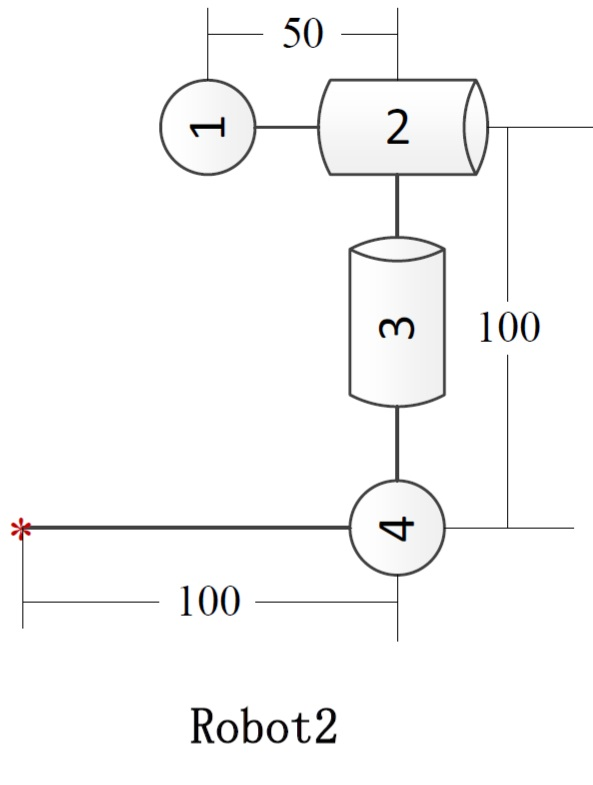
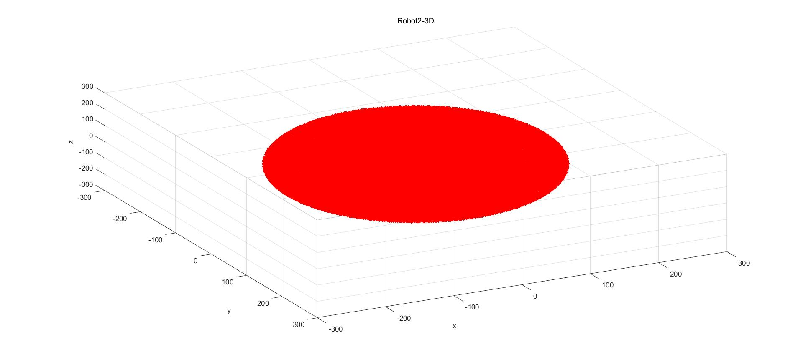
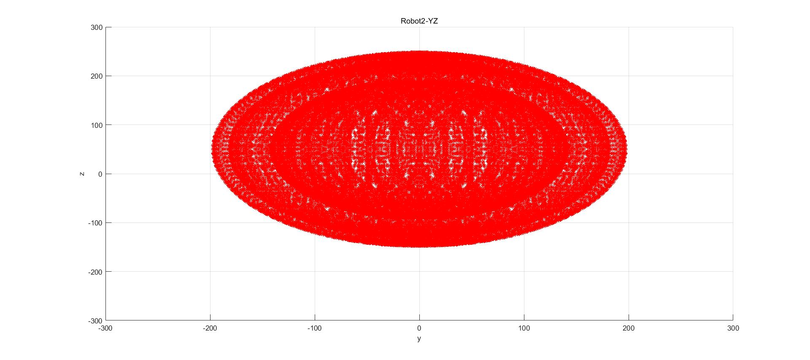
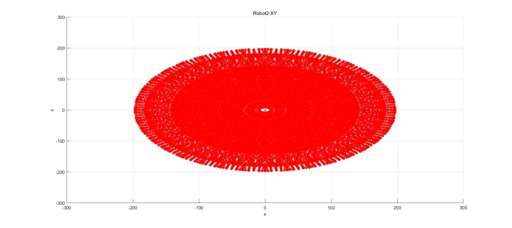

    

## Contents
1. [Parameter](#Parameter)
2. [Install Matlab](#Install Matlab)
3. [Quick Start](#Quick start)
4. [Workspace](#Workspace)

## Parameter
### Joint DOF

    

### Angle limit
Joint 1 : -90-90 degrees
Joint 2 : -180-180 degrees
Joint 3 : -180-180 degrees
Joint 4 : 0-180 degrees

### Arm 
Joint 1 to 2: 50cm
Joint 2 to 4: 100cm
Joint 4 to 5: 100cm

## Install Matlab

## Quick Start
Open matlab
set path under ./matlab_robot_workspace/code and run Workspace_Robot2_Jc.m file.

    

## Workspace

###3D

    

###Main view

    

###Left view

    

###Vertical view

    

